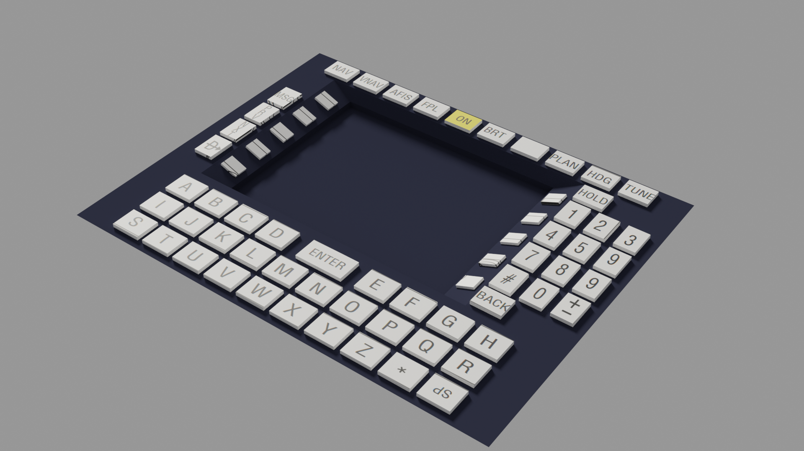

\# Honeywell GNS-XLS – FMS Simulation (Prototype)

This repository contains some pictures of a \*\*prototype simulation of the Honeywell GNS-XLS Flight Management System (FMS)\*\* developed for X-Plane.

The project is a personal effort focused on understanding and modeling real-world avionics systems, FMS logic, and their integration with the X-Plane SDK and SASL. 

&nbsp;

Important: this is just a simulation.

---

\## Project Scope

The goal of this project is to explore:

\- avionics system modeling and state-driven logic  

\- FMS page architecture and input handling  

\- interaction between UI, navigation data, and simulator APIs  

\- performance and structural trade-offs between SASL and native C++

---

\## Implementation Overview

\### FMS Logic \& Architecture

\- Design of the \*\*GNS logical architecture\*\* (pages, states, inputs, navigation)

\- Architecture primarily defined through \*\*pseudocode\*\*, derived from:

&nbsp; - official reference manuals

&nbsp; - secondary technical sources (e.g. explanatory videos)

\- State-based approach for page navigation and input context management

\### 3D Model \& Interaction

\- \*\*3D modeling from scratch in Blender and official plugin of Xplane\*\*

\- Minimal texture work at the current stage, mainly used as a \*\*visual and structural reference\*\*

\- Design and implementation of \*\*X-Plane manipulators\*\* for user interaction

\### Rendering \& Simulator Integration

\- Rendering of avionics information on \*\*panel textures\*\*

\- Implementation using \*\*SASL (Lua)\*\* for X-Plane

\- Experimental \*\*C++ tests\*\* for:

&nbsp; - flight plan parsing

&nbsp; - SID/STAR lookup based on airport and runway data

\- Integration with \*\*X-Plane datarefs and commands\*\*

\### Architecture Evolution

\- Ongoing investigation of a \*\*transition from SASL to C++\*\*

\- Focus on overcoming performance, scalability, and structural limitations

\- Modular design intended to support future extensions

---

\## Planned / Conceptual Features

The architecture is designed to support future development of:

* waypoint management  
* flight plan editing  
* conceptual SID/STAR logic 
* vnav 

These features are currently implemented at a \*\*conceptual or partial prototype level\*\*.

---

\## Project Status

\*\*Concept / Prototype Stage\*\*

Development is focused on:

\- system architecture

\- logic design

\- technical feasibility

This repository reflects an exploratory and iterative development process.

---

\## Disclaimer

This project is for \*\*educational and research purposes only\*\*.  

