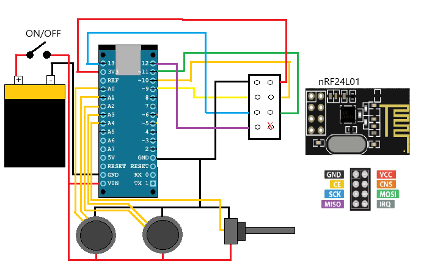
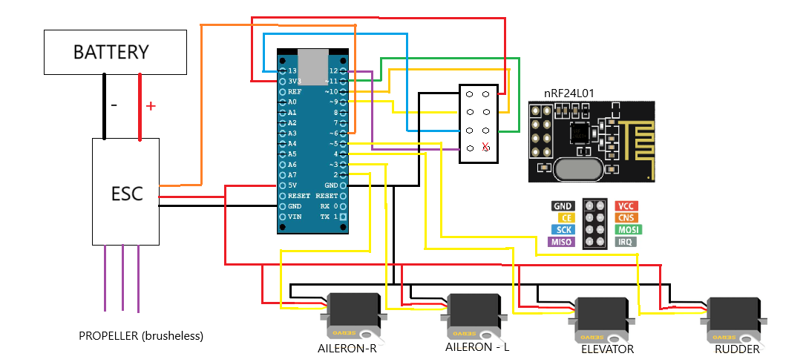

# Flying Model Project ✈️

A homemade radio-controlled aircraft designed and built from scratch.  
This repository documents the entire design process: from aerodynamic calculations to the electronics and construction techniques used.

## Overview

This project was born out of curiosity and a passion for aviation. The goal: build a flyable RC airplane without using pre-made kits or copying existing models. All design choices — wing profile, tail sizing, motor, electronics — were guided by aeronautical references and adjusted to suit amateur-level materials and tools.

## Circuits

Here’s a preview of the transmitter circuit and early airframe assembly:

  
  

## Documentation

Full documentation of all steps of development in the following pdf:

📄 [Full Technical Report (PDF)](RC_aircraft.pdf)

## License

This project is released under the MIT License. Feel free to build your own model and improve upon it!

## Author

[Michele Marro](https://github.com/mm-89)